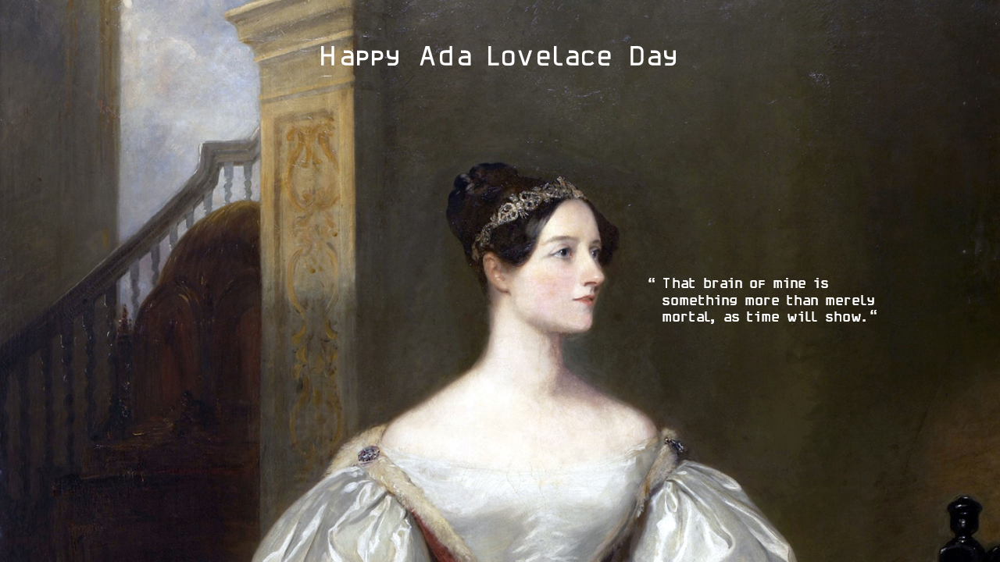

WiMCS welcomes people at different stages of their careers or studies! Through mentorship programs, career and research focused events, and networking opportunities, we help connect women in the early stages of their academic journey with valuable guidance and support. Meanwhile, we are always seeking student volunteers interested in becoming leaders and assisting in organizing WiMCS events for the upcoming Ada Lovelace Day.

Attending our upcoming [Ada Lovelace Day](https://en.wikipedia.org/wiki/Ada_Lovelace_Day) event by joining our [mailing list](simeng.qiu@swansea.ac.uk)! 

